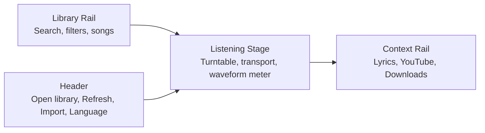

# musicx

musicx is a local-first desktop music player for macOS. It combines an app-managed local library, YouTube-to-MP3 downloads, synced lyrics, playlist controls, and a polished listening-stage interface in one Tauri app.

The current app identity is:

- Product name: `musicx`
- Bundle identifier: `com.musicx`
- Version: `0.2.1`
- Primary target: macOS arm64
- Stack: Tauri 2, React 19, TypeScript, Vite, Rust

## Features

- Import local audio files into a managed library.
- Search YouTube videos and download audio as local MP3 files.
- Load synced lyrics from local sidecars, embedded metadata, YouTube subtitles, or LRCLIB.
- Highlight and auto-scroll lyrics while the song plays, with persisted lyric offset controls for fine alignment.
- Build a real library with favorites, recent plays, persistent queue, sorting, and right-click row actions.
- Build DMGs with an explicitly sealed ad-hoc macOS app bundle when no Developer ID certificate is available.
- Play, pause, scrub, seek, adjust volume, delete tracks, shuffle, and repeat.
- Control macOS system output volume from the in-app volume slider.
- Show per-track artwork in the collection when artwork is available.
- Use English or Simplified Chinese UI text.
- Keep running in the background when the macOS close button is clicked.
- Reopen the hidden main window from the Dock.
- Run a browser-only mock mode for frontend development without Tauri.

## Interface

musicx is organized around a central listening stage:



The main player shows the selected song, artwork, a turntable-style record, previous/play-next controls, a draggable progress slider, shuffle/repeat controls, macOS volume control, and a music-reactive signal meter.

The right context rail contains:

- Lyrics: synced timeline and active-line highlighting.
- YouTube: search, result cards, and download buttons.
- Downloads: progress status for the active YouTube download.

The left library rail contains:

- Search across song title, artist, and album.
- Source filters: `All`, `Favorites`, `Recent`, `Local`, `YouTube`.
- Sort controls for added date, title, artist, duration, and last-played time.
- Persistent `Up next` queue with play-next, add-to-end, remove, and clear actions.
- Song rows with artwork, title, metadata, source, duration, favorite, queue, play, context menu, and delete actions.
- Library statistics for tracks, lyric-ready tracks, and active downloads.

## Install

Prerequisites:

- macOS, preferably Apple Silicon for the included release artifact.
- Node.js and `pnpm`.
- Rust and Cargo.
- Network access for YouTube search/download and remote lyric lookup.

Install JavaScript dependencies:

```bash
pnpm install
```

## Run

Run the full desktop app:

```bash
pnpm tauri dev
```

Run the frontend-only browser demo:

```bash
pnpm dev
```

The browser demo uses mock data and simulated downloads. It is useful for UI work, but YouTube download, local file import, system volume, and app-local storage require the Tauri desktop app.

## Build

Build the frontend:

```bash
pnpm build
```

Build the macOS desktop bundles:

```bash
pnpm tauri build
```

Observed release artifacts:

- `src-tauri/target/release/bundle/macos/musicx.app`
- `src-tauri/target/release/bundle/dmg/musicx_0.2.1_aarch64.dmg`

The current local bundle is ad-hoc signed and not notarized.

## GitHub Preparation

Before pushing this project to GitHub, review [GITHUB_RELEASE_CHECKLIST.md](./GITHUB_RELEASE_CHECKLIST.md). It documents ignored files, release validation, first-push commands, and the recommended Git LFS policy for the bundled ffmpeg sidecar.

## Test

Run the full project test command:

```bash
pnpm test
```

Run only the Rust tests:

```bash
pnpm test:rust
```

Run only the frontend UI tests:

```bash
pnpm test:ui
```

There are Rust unit tests for YouTube URL handling, search parsing, subtitle parsing, lyrics repair, lyric offset persistence, system volume conversion, delete behavior, favorite/recent metadata persistence, demo asset creation, and temporary data migration. Vitest UI tests cover lyric offset controls, active lyric alignment, WebVTT parsing, download retry behavior, library sorting/queue helpers, and track-row favorite/queue/context-menu actions.

## Using musicx

### Import Local Audio

Click `Import MP3`, choose one or more audio files, and musicx copies them into its managed library. Despite the button label, the importer accepts:

- `mp3`
- `m4a`
- `wav`
- `flac`
- `aac`
- `ogg`

When importing, musicx reads metadata, duration, embedded artwork, and embedded lyrics when available. It also looks for sidecar lyrics next to the source file with these extensions:

- `.lrc`
- `.txt`
- `.vtt`
- `.srt`

If local lyrics are missing, musicx tries to find a matching lyric document from LRCLIB using the track title, artist, album, and duration.

### Search And Download From YouTube

Open the `YouTube` panel, enter a query, and click `Search`. musicx uses `yt-dlp` to fetch video results.

Click `Download MP3` to convert the selected video to a local MP3. musicx:

- Resolves the video URL from the result.
- Uses `yt-dlp` to download and convert audio.
- Uses `ffmpeg` for MP3 extraction.
- Saves the MP3 into the app-managed library.
- Saves thumbnail artwork when available.
- Downloads subtitles when available.
- Converts subtitles into synced lyrics.
- Falls back to LRCLIB when subtitles are missing or too sparse.
- Emits progress states for queued, preparing, downloading, converting, saving, done, and error.
- Retries recoverable download failures such as rate limits, timeouts, and transient network errors before surfacing a retry action.

Double-clicking a YouTube result, or pressing `Enter`/`Space` on a focused result, downloads the result, adds it to the library, and starts playback when the download completes.

YouTube behavior depends on network access, YouTube availability, `yt-dlp`, subtitle availability, and rate limits.

### Lyrics

The `Lyrics` panel shows timed lyric lines and highlights the active line based on playback time. It auto-scrolls without stretching the whole player stage.

Lyrics can come from:

- Local sidecar files.
- Embedded audio metadata.
- YouTube subtitles.
- LRCLIB exact or search matches.
- Built-in demo lyrics.

Use `Find lyrics` to retry lyric lookup for the selected track. Use the lyric offset controls to move lyrics earlier or later in 0.5 second steps; the offset is saved with the track.

### Playback

musicx uses an HTML audio element inside the Tauri webview. The player supports:

- Play and pause.
- Previous and next track.
- Draggable timeline seeking.
- Sequential or shuffle play.
- Repeat off, repeat all, and repeat one.
- Automatic next-track handling when a song ends.
- Music-reactive signal bars powered by Web Audio frequency analysis.
- macOS system volume integration in desktop mode.
- External macOS volume changes sync back into the app volume slider.

### Keyboard Shortcuts

| Shortcut | Action |
| --- | --- |
| `Space` | Play or pause |
| `Left Arrow` | Seek backward 10 seconds |
| `Right Arrow` | Seek forward 10 seconds |
| `Up Arrow` | Increase volume by 5% |
| `Down Arrow` | Decrease volume by 5% |
| `Command + O` | Open the library drawer |
| `Command + R` | Refresh the library |
| `Command + N` | Next track |
| `Command + P` | Previous track |
| `Command + S` | Focus the YouTube search box |

Shortcuts are ignored while typing in an input, textarea, select, or editable field.

### Deleting Songs

Use the delete button in the library row. musicx asks for confirmation, removes the database row, deletes the managed audio copy, and deletes managed artwork when safe.

Deleting an imported song does not delete the original source file outside the app library. The built-in demo song cannot be deleted.

## Storage

musicx stores user data in Tauri's app-local data directory for `com.musicx`.

Inside that directory it creates:

- `musicx.sqlite3`: SQLite library database.
- `library/`: copied local tracks and downloaded YouTube MP3 files.
- `artwork/`: extracted or downloaded cover art.
- `bin/`: runtime helper binaries such as downloaded `yt-dlp`.
- `tmp/`: temporary YouTube download jobs.

In the desktop app, click `Saved library` in the runtime footer to open the managed `library/` folder in Finder. The UI intentionally does not print the full `/Users/...` path.

At startup, musicx also attempts to migrate data back from a temporary `com.cantodeck` directory if such data was created during the short-lived rename experiment.

## Runtime Dependencies

### yt-dlp

musicx prepares `yt-dlp` in this order:

1. Use a working copy already present in app data.
2. Use `yt-dlp` from `PATH`.
3. Use `python3 -m yt_dlp`.
4. Download the official standalone binary into the app data `bin/` directory.

On macOS, the standalone binary URL ends with `yt-dlp_macos`.

### ffmpeg

musicx prepares `ffmpeg` in this order:

1. App data `bin/`.
2. `ffmpeg-sidecar` path.
3. The current executable directory.
4. Common system paths such as Homebrew.
5. Automatic sidecar download when the sidecar directory is writable.

The Tauri bundle declares `src-tauri/binaries/ffmpeg-aarch64-apple-darwin` as an external binary for macOS arm64 packaging. That binary is intentionally ignored by Git by default. Before building a fresh clone, provide that file through Git LFS, a release artifact, or a local setup step. See [src-tauri/binaries/README.md](./src-tauri/binaries/README.md).

## Troubleshooting

### YouTube Search Fails

Check network access and verify `yt-dlp` can run. If the cached binary is stale, musicx tries to refresh it automatically.

### YouTube Download Fails

Downloads can fail because of YouTube rate limits, unavailable videos, subtitle rate limits, missing `ffmpeg`, network problems, or `yt-dlp` extractor changes. Subtitle failures are treated as recoverable when possible; audio download failures are not.

### No Lyrics Are Found

Try a cleaner track title and artist, add a sidecar `.lrc`, `.vtt`, `.srt`, or `.txt` file next to the source audio before importing, or use a YouTube result that has subtitles.

### Volume Does Not Change

System volume control is macOS-specific and uses `osascript`. It only runs in desktop mode.

### The App Did Not Quit When Closed

On macOS, clicking the red close button hides the main window so playback and app state can continue. Use `Command + Q` to quit the app.

## Project Structure

```text
.
├── src/                         # React frontend
│   ├── App.tsx                  # Main app shell, state, shortcuts, layout wiring
│   ├── App.css                  # macOS-style responsive UI
│   ├── components/              # Player, library, lyrics, YouTube, downloads panels
│   ├── hooks/                   # Audio playback, audio meter, artwork accent extraction
│   ├── lib/                     # Tauri bridge, formatting, lyric helpers, mock data
│   ├── i18n.ts                  # English and Simplified Chinese translations
│   └── types.ts                 # Frontend data types
├── src-tauri/                   # Rust backend and Tauri config
│   ├── src/
│   │   ├── lib.rs               # Tauri commands and app lifecycle
│   │   ├── library.rs           # SQLite library, import, delete, metadata extraction
│   │   ├── youtube.rs           # YouTube search/download, yt-dlp integration
│   │   ├── lyrics.rs            # LRCLIB lookup and lyric document parsing
│   │   ├── subtitles.rs         # LRC/VTT/SRT/plain text parsing
│   │   ├── binaries.rs          # yt-dlp and ffmpeg preparation
│   │   ├── system_volume.rs     # macOS system volume control
│   │   ├── paths.rs             # App data paths and temporary rename migration
│   │   └── demo.rs              # Built-in demo track generation
│   └── tauri.conf.json          # Tauri product, bundle, window, security config
├── package.json                 # Frontend scripts and dependencies
└── Musicx_Requirement.md        # Rebuild-level product and implementation specification
```

## Release Status

The local release artifacts were verified with:

- `pnpm build`
- `cargo test --manifest-path src-tauri/Cargo.toml`
- `cargo clippy --manifest-path src-tauri/Cargo.toml -- -D warnings`
- `pnpm tauri build`

The app is functional as a local macOS release artifact, but it is not notarized and does not include a published auto-update channel.
